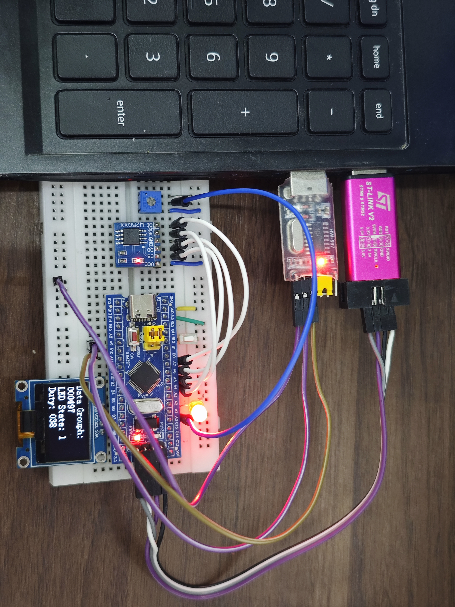
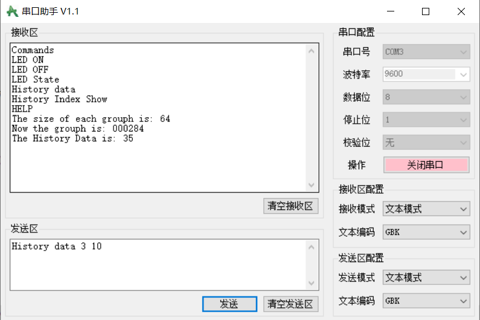

# STM32 Data Acquisition and Storage System

## Project Overview

This project is a data acquisition and storage system based on the STM32F103 microcontroller. It implements periodic ADC data acquisition, DMA transfer, external Flash storage, serial command interaction, and LED control.

The project provides two implementations of the same system:

- **Bare-Metal** — based on the STM32 main loop and interrupt mechanisms.
- **FreeRTOS** — based on tasks, semaphores, mutexes, and interrupt-to-task synchronization.

The two versions share the same hardware functions while using different software architectures.
## Features

- Timer-Driven ADC Acquisition — Periodic ADC1 sampling triggered by TIM3 with deterministic sampling intervals.
- DMA-Based Data Transfer — ADC samples are transferred to memory through DMA with minimal CPU intervention.
- Buffered Batch Processing — 64-sample acquisition buffers are processed as independent data groups for subsequent storage and analysis.
- External Non-Volatile Storage — W25Q64 SPI Flash is used for persistent storage of acquired ADC data and historical data retrieval.
- Interrupt-Driven USART Communication — USART1 receives commands through interrupts and a Ring Buffer, reducing blocking operations in the application.
- Command-Based Data and Device Control — A lightweight serial command interface supports historical data queries and LED control.
- PWM-Based LED Control — TIM2 generates PWM signals for software-adjustable LED brightness.
- Event-Driven Input Handling — Button input is integrated into the application control flow through event-based processing.
- FreeRTOS Task-Based Architecture — The RTOS implementation separates data acquisition, storage, serial communication, and device control into independent tasks.
- RTOS Synchronization and Resource Protection — Binary semaphores and mutexes are used for interrupt-to-task synchronization and shared Flash resource protection.

## Serial Commands

The system supports the following commands:

```text
HELP
LED ON
LED OFF
LED State
History Index Show
History data <Group> <Index>
```

For example:

```text
History data 3 10
```

This command reads the 10th sample from the 3rd stored data group.

Other commands:

- `HELP` - Display the list of supported commands.
- `LED ON` - Turn on the LED.
- `LED OFF` - Turn off the LED.
- `LED State` - Display the current LED state.
- `History Index Show` - Display the number of stored data groups.
- `History data <Group> <Index>` - Read a specific sample from a stored data group.

## Hardware Platform

- MCU: STM32F103
- External Flash: W25Q64
- Display: OLED
- Communication: USART1
- ADC: ADC1
- DMA: DMA1 Channel 1
- PWM: TIM2
- ADC Trigger: TIM3


## Software Environment

- Keil MDK
- STM32F10x Standard Peripheral Library
- ARM Compiler
- FreeRTOS


## Project Structure

```text
STM32-Data-Acquisition-System/
│
├── BareMetal/
│   ├── Hardware/
│   ├── Library/
│   ├── Start/
│   ├── User/
│   └── Project.uvprojx
│
├── FreeRTOS/
│   ├── Hardware/
│   ├── Library/
│   ├── Start/
│   ├── FreeRTOS/
│   ├── User/
│   └── Project.uvprojx
│
├── Docs/
├── README.md
└── .gitignore
```

## Bare-Metal Version

The Bare-Metal version uses the STM32 main loop, interrupts, DMA, and modular peripheral drivers to implement data acquisition, storage, serial communication, and device control.

## FreeRTOS Version

The FreeRTOS version organizes the system into multiple tasks and uses synchronization mechanisms for communication between interrupts and tasks, as well as shared resource protection.

The FreeRTOS implementation includes:

- Task-based system architecture
- Binary semaphores for interrupt-to-task synchronization
- Mutex for shared W25Q64 Flash access
- Ring Buffer for USART reception
- DMA-based data acquisition
- W25Q64 data storage and retrieval

## Demo

### Hardware Setup

The following photo shows the hardware setup used for this project.



### Serial Terminal

The serial terminal can be used to send commands and query stored data.



